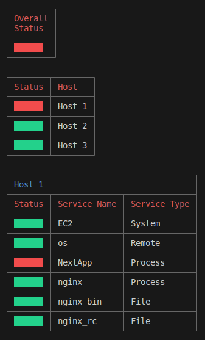

# Monit Central

## Description

A CLI tool to centralize monitoring of multiple monit hosts.



## Installation

```
npm install -g
```

## Usage

1. Setup your monit hosts.

   [Monit Guide](https://www.youtube.com/watch?v=wiRt3mY7Rrw&ab_channel=tutoriaLinux)

   [Monit Documentation](https://mmonit.com/monit/documentation/monit.html)

2. Add your hosts to the config.

   ```
   monitCentral add -t ssh -ip 1.2.3.4 -u ubuntu -path /path/to/key
   ```

3. Start Monit Central

   ```
   monitCentral start
   ```

## Contributing

PRs accepted.

Contact me if you wish to contribute.

## License

MIT © Daniel Bray
